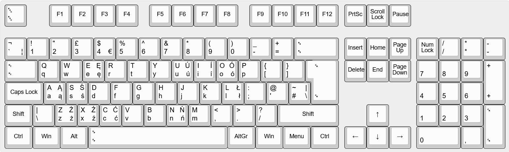

# Polish (UK Layout) Keyboard for Windows

[polski](#polskie-znaki-na-klawiaturę-brytyjską)

## Installation

1. Download a [release](https://github.com/nyabla/polish-uk-keyboard-layout/releases/latest)
2. Extract the zip
3. Run `setup.exe`
4. Restart your computer
5. Add input method in language settings

## Modifying and building

Use [Microsoft Keyboard Layout Creator](https://www.microsoft.com/en-us/download/details.aspx?id=102134) to edit and build installation package.

## Polskie znaki na klawiaturę brytyjską

### Instalacja

1. Pobierz [wydanie](https://github.com/nyabla/polish-uk-keyboard-layout/releases/latest)
2. Wyekstraktuj zip
3. Zainstaluj za pomocą instalatora `setup.exe`
4. Zrestartuj komputer
5. Dodaj klawiaturę *Polish (UK Layout)* w opcjach językowych

### Modifikacja i kompilacja

Używane jest [Microsoft Keyboard Layout Creator](https://www.microsoft.com/en-us/download/details.aspx?id=102134) do modifkowania i kompilacji instalatora.
